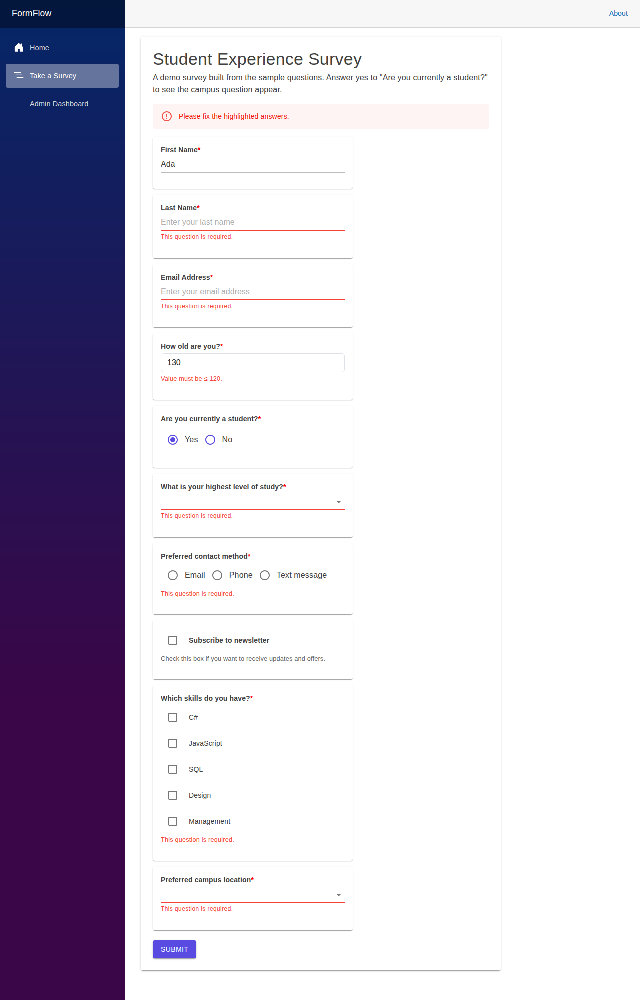
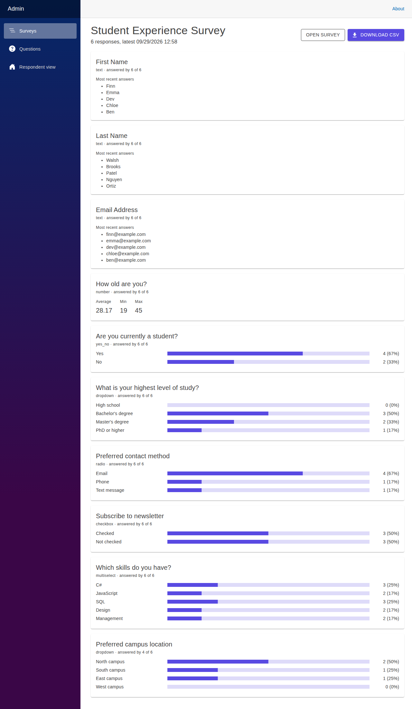
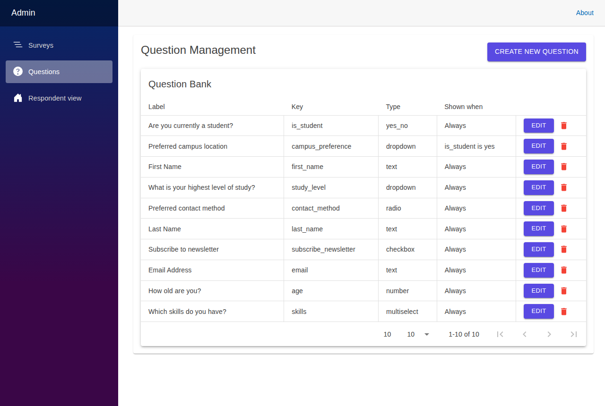
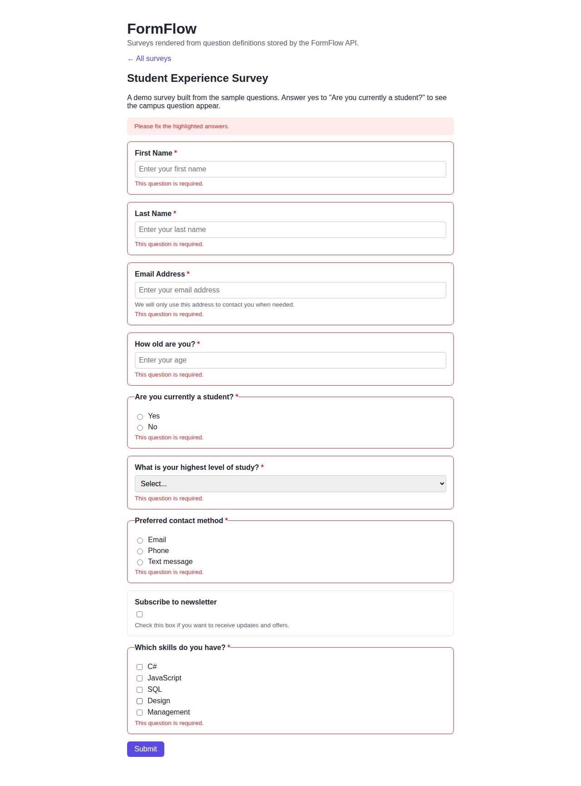
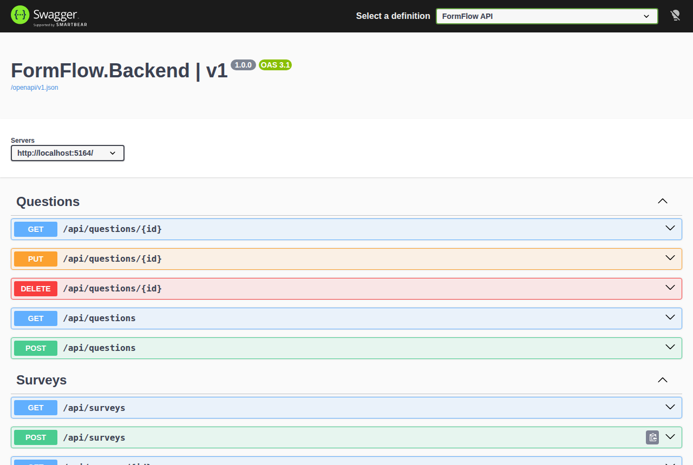
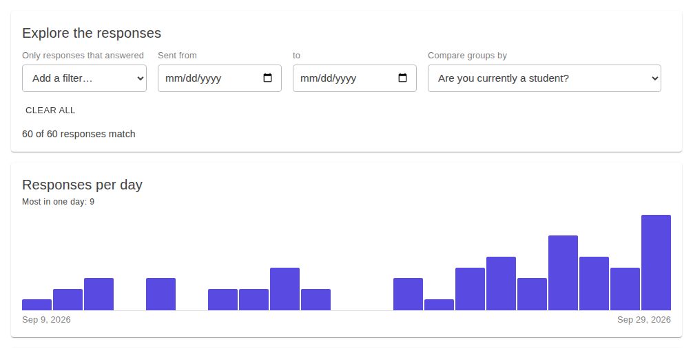
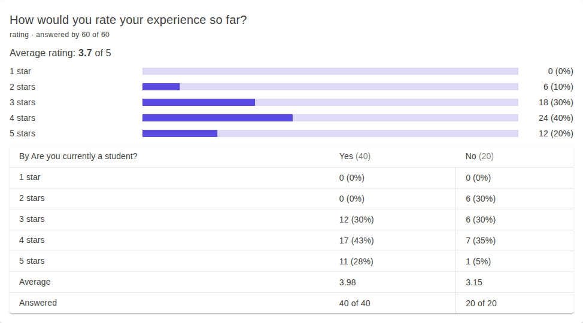
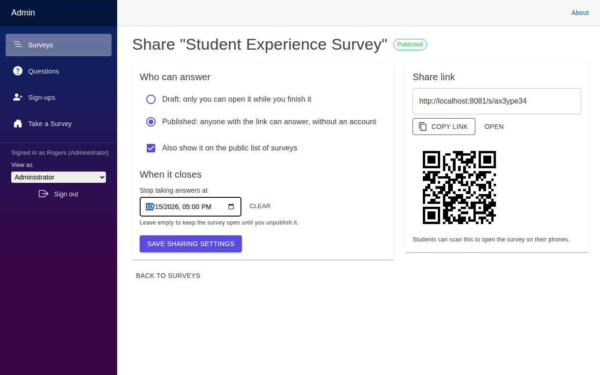
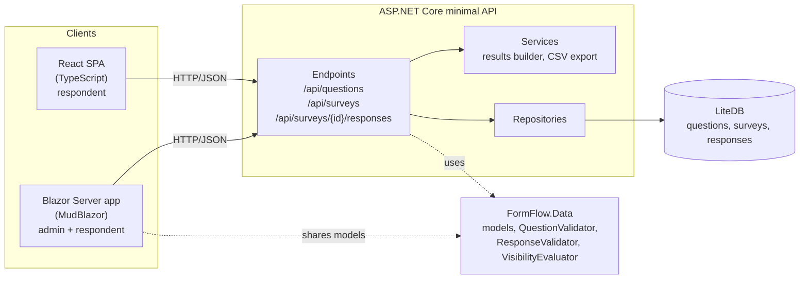

[](https://github.com/Gameyplum303/form-flow/actions/workflows/ci.yml)
[](https://github.com/Gameyplum303/form-flow/actions/workflows/lint.yml)
[](https://github.com/Gameyplum303/form-flow/actions/workflows/ci.yml)


[](LICENSE)

# FormFlow

FormFlow is a survey builder where the questions live in a database instead of in code. Admins build a question bank, group questions into surveys, and publish them. Respondents fill them out in a Blazor or React front end, the API validates and stores every answer, and admins see live results, filter and compare them, and export them to CSV.

**[Try the live demo](https://gameyplum-formflow.onrender.com)**: sign in as `admin` / `password` or `professor` / `password`, or just take the survey. The same survey is in the [React app](https://gameyplum-formflow-react.onrender.com), and the API is in [Swagger UI](https://gameyplum-formflow-api.onrender.com/swagger). It runs on a free plan, so the first visit can take about a minute while it wakes up, and it resets itself now and then.

It started as the capstone team project for the Software Engineering BS at East Carolina University (ECU Pirate Forge) and has since been extended into a complete, end-to-end application.



## Highlights

- **Questions are data, not code.** Eleven question types (text, long text, number, email, date, star rating, yes/no, dropdown, radio, checkbox, multiselect) with labels, help text, options, required flags and validation rules, all stored in LiteDB and editable at runtime.
- **Conditional questions.** A question can be shown only when a yes/no question has a given answer ("Preferred campus" appears only for students). The same rule runs in C# on the server and in TypeScript in the browser, and hidden answers are dropped before they are saved.
- **One validator, three clients.** Every submission goes through a single server-side `ResponseValidator` that returns RFC 7807 problem details keyed by question, so the Blazor and React apps show the same errors next to the same fields.
- **Survey sharing.** Surveys start as private drafts. The owner publishes one from its Share page, which shows a short link (`/s/k7m2p9qa`) with a copy button and a QR code, chooses whether it also appears on the public list, and can set a close date. Respondents have no account, so each browser gets a temporary respondent id and the API accepts one answer per browser.
- **Templates and duplicates.** Start a survey from a ready-made template (course evaluation, event feedback, research study intake with consent, customer satisfaction) or copy an existing survey into a new draft with one click.
- **Multi-page surveys that remember answers.** Split a survey into pages with a switch per question. Respondents get "Page 2 of 3", a progress bar and Back and Next, with each page checked before moving on and pages of hidden questions skipped. Answers are kept in the browser, so a respondent who leaves can pick up where they stopped.
- **Full admin loop.** Create, edit, reorder and delete questions and surveys, duplicate a survey, preview it, see per-question results (option counts, number stats, recent text answers) and download responses as CSV.
- **Survey analytics.** Filter results to respondents who gave certain answers, narrow them to a date range, compare groups side by side (students against non-students, say), and see a chart of responses per day that counts days in the viewer's time zone. The CSV download follows the same filters. All of it is computed on the server from one query, so the page and the file always agree.
- **Secure admin area.** Accounts sign in with a JWT issued by the API. Administrators manage everything and can preview the site as a professor or student. Professors and scientists sign up (name, email, date of birth, organization and intended use), verify their email, wait for an administrator to approve them, then build surveys and see results only for the surveys they created. Students take surveys without an account. Passwords are hashed with PBKDF2 and can be reset through a one-hour, single-use emailed link (only its hash is stored), changing a password signs the account out everywhere, sign-in and submissions are rate limited, and every role and ownership rule is enforced on the server, while respondents never need an account.
- **Safe by design.** Question keys that are in use can't be renamed, questions used by a survey or a visibility rule can't be deleted, and CSV cells are escaped against spreadsheet formula injection.
- **Documented, tested, automated.** OpenAPI with Swagger UI, 500+ unit and integration tests with coverage reporting, and Playwright browser tests that run against the Docker images in GitHub Actions on every push.
- **One command to run.** `docker compose up` starts the API, the Blazor app and the React app.

## Screenshots

| Survey results (admin) | Question bank (admin) |
|---|---|
|  |  |

| React client | Swagger UI |
|---|---|
|  |  |

**Analytics:** filter, pick dates, and compare groups; the chart counts responses per day, week or month.

| Filters and timeline | Comparing groups |
|---|---|
|  |  |

**Sharing a survey:** publish it, choose whether it's listed, set a close date, and hand out the link or QR code.



## Architecture



| Project | What it is |
|---|---|
| `FormFlow.Data` | Shared class library: the models, question validation, response validation and the visibility rules. Referenced by the API and the Blazor app so both speak the same types. |
| `FormFlow.Backend` | ASP.NET Core minimal API grouped by resource, with repositories over LiteDB, a results builder, a CSV exporter and a database seeder. |
| `FormFlow.Blazor` | Blazor Server app with MudBlazor. Admin pages for questions, surveys and results, plus the respondent flow. Each question type is its own component chosen at runtime. |
| `FormFlow.React` | React 19 + TypeScript client for respondents: survey list, dynamic form, conditional questions, server error display. |
| `*.Tests` | xUnit + FluentAssertions + Moq for the API and data layer, bUnit for Blazor components, Jest + React Testing Library for React. |
| `FormFlow.E2E` | Playwright browser tests against the running apps. |

More detail: [docs/architecture.md](docs/architecture.md).

## Tech stack

| Area | Technology |
|---|---|
| API | .NET 10, ASP.NET Core minimal APIs, OpenAPI + Swagger UI |
| Security | JWT bearer tokens, ASP.NET Core Identity password hashing, rate limiting |
| Storage | LiteDB 5 (embedded document database, no server to install) |
| Web UI | Blazor Server, MudBlazor 9 |
| SPA | React 19, TypeScript |
| Testing | xUnit, FluentAssertions, Moq, `WebApplicationFactory`, bUnit, Jest, React Testing Library, Playwright, coverlet |
| Delivery | Docker (multi-stage images, non-root), docker compose, a Render Blueprint for the public demo |
| CI | GitHub Actions: build, test, coverage, ESLint, `dotnet format`, Docker build and browser tests |

## Deploy the demo

[](https://render.com/deploy?repo=https://github.com/Gameyplum303/form-flow)

[`render.yaml`](render.yaml) deploys the API, the Blazor app and the React app to Render's free plan, and runs the [live demo](https://gameyplum-formflow.onrender.com). The demo seeds 80 sample responses so the results and charts have something to show, has public `admin` and `professor` accounts, and resets itself whenever it restarts. See [docs/deployment.md](docs/deployment.md).

## Run it with Docker

With [Docker](https://docs.docker.com/get-docker/) installed:

```bash
git clone https://github.com/Gameyplum303/form-flow.git
cd form-flow
docker compose up --build
```

| App | URL |
|---|---|
| Blazor app (admin and respondent) | http://localhost:5224 |
| React app (respondent) | http://localhost:3000 |
| API and Swagger UI | http://localhost:5164/swagger |

Sign in as `Rogers` / `password` (administrator) or with the test professor account `professor` / `password`, or sign up as a new professor, open the verification link from the administrator's **Emails** page, and approve yourself on the **Sign-ups** page. Without an SMTP server, emails wait on that page instead of being sent; set `FORMFLOW_SMTP_HOST` (and `_PORT`, `_USERNAME`, `_PASSWORD`) to send them for real. Students take surveys without an account. Data is kept in a Docker volume; `docker compose down --volumes` resets it. Before exposing the app anywhere public, set `FORMFLOW_ADMIN_PASSWORD` and `FORMFLOW_PROFESSOR_PASSWORD` to real passwords and `FORMFLOW_JWT_KEY` to a fixed key (32+ characters), before the first start.

## Run it locally

Prerequisites: [.NET 10 SDK](https://dotnet.microsoft.com/download) and [Node.js 20+](https://nodejs.org).

```bash
git clone https://github.com/Gameyplum303/form-flow.git
cd form-flow
dotnet dev-certs https --trust   # one time, so the Blazor app can call the API over HTTPS
```

**1. API** (http://localhost:5164, https://localhost:7209)

```bash
cd FormFlow.Backend
dotnet run
```

On first start it creates `formflow.db`, loads 13 sample questions and builds a demo "Student Experience Survey" from them. Open http://localhost:5164/swagger to try the endpoints.

**2. Blazor app** (https://localhost:7230), in a second terminal

```bash
cd FormFlow.Blazor
dotnet run
```

Go to **Take a Survey** to answer the demo survey, or **Admin Dashboard** to manage questions and surveys and see results. In Development you can sign in as `Rogers` / `password` (administrator), or `professor` / `password` (builds surveys and sees results for their own). Students take surveys without signing in. New professors and scientists can sign up at `/signup`, verify their email, and an administrator approves them on the **Sign-ups** page. In Development emails aren't sent: the administrator reads them, with their links, on the **Emails** page. As the administrator, **View as** in the menu shows the site as a professor or a student would see it.

**3. React app** (http://localhost:3000), in a third terminal

```bash
cd FormFlow.React
npm install
npm start
```

The React app calls the API at `http://localhost:5164`. Set `REACT_APP_API_URL` to point it somewhere else.

To start over with a clean database, stop the API and delete `FormFlow.Backend/formflow.db`.

## API

| Method | Path | Access | Purpose |
|---|---|---|---|
| `POST` | `/api/auth/login` | Public | Sign in and get a token (rate limited) |
| `GET` | `/api/auth/me` | Signed in | Check a token and its role |
| `POST` | `/api/auth/signup` | Public | Sign up as a professor/scientist (rate limited) |
| `POST` | `/api/auth/verify-email`, `/resend-verification` | Public | Verify an email from its link, or ask for a new link |
| `POST` | `/api/auth/forgot-password`, `/reset-password` | Public | Email a reset link, then set a new password with it |
| `POST` | `/api/auth/change-password` | Signed in | Change your password and sign out other sessions |
| `GET` | `/api/accounts/outbox` | Admin | Emails waiting in the outbox when no SMTP server is set |
| `GET` | `/api/accounts/pending` | Admin | List sign-ups waiting for approval |
| `POST` | `/api/accounts/{id}/approve`, `/decline` | Admin | Approve or decline a sign-up |
| `GET` | `/api/questions` | Public | List all questions |
| `GET` | `/api/questions/{id}` | Public | Get one question |
| `POST` | `/api/questions` | Builder | Create a question |
| `PUT` | `/api/questions/{id}` | Builder | Update a question |
| `DELETE` | `/api/questions/{id}` | Builder | Delete a question that nothing depends on |
| `GET` | `/api/surveys` | Public | List the published, listed surveys that are still open |
| `GET` | `/api/surveys/{id}` | Public | Get one published survey (drafts only for the people who manage them) |
| `GET` | `/api/share/{code}` | Public | Open a published survey by the code in its share link |
| `GET` | `/api/surveys/{id}/questions` | Public | Get a survey's questions in order, ready to render |
| `GET` | `/api/surveys/managed` | Builder | List the surveys the caller can manage |
| `POST` | `/api/surveys` | Builder | Create a survey |
| `PUT` | `/api/surveys/{id}` | Builder | Update a survey |
| `DELETE` | `/api/surveys/{id}` | Builder | Delete a survey and its responses |
| `PUT` | `/api/surveys/{id}/sharing` | Builder | Publish or unpublish, list or unlist, and set a close date |
| `POST` | `/api/surveys/{id}/responses` | Public | Submit answers (validated, rate limited; 400 problem details per question, 409 once closed or already answered) |
| `GET` | `/api/surveys/{id}/answered?respondentId=` | Public | Whether a browser already answered |
| `GET` | `/api/surveys/{id}/responses` | Builder | List stored responses |
| `GET` | `/api/surveys/{id}/results` | Builder | Aggregated results per question, with optional filters, dates, timeline and group comparison |
| `GET` | `/api/surveys/{id}/responses/export` | Builder | Download responses as CSV, with the same optional filters |

Signed-in requests send `Authorization: Bearer <token>`. "Signed in" endpoints accept any role. "Builder" endpoints accept administrators and professors and return `403` when a professor touches a question or survey someone else created. "Admin" endpoints accept administrators only.

Request and response examples are in [docs/api.md](docs/api.md), and [FormFlow.Backend/backend.http](FormFlow.Backend/backend.http) has ready-to-send requests for VS Code or Rider.

## Testing

```bash
dotnet test FormFlow.slnx                 # Data, Backend and Blazor tests

cd FormFlow.React.Tests
npm install
npm test                                  # React tests

docker compose up --build --detach --wait # browser tests, against the Docker images
cd FormFlow.E2E
npm ci && npx playwright install chromium
npx playwright test
```

| Suite | Tests | Covers |
|---|---|---|
| `FormFlow.Data.Tests` | 98 | Question rules and their numeric values, response validation for every question type, sign-up rules, rating scales, visibility chains and cycles |
| `FormFlow.Backend.Tests` | 201 | Every endpoint through `WebApplicationFactory` with an in-memory LiteDB, sign-in, sign-up, email verification and approval, password reset and change, link expiry, each role, survey and question ownership, owner details hidden from the public, CORS, error handling, drafts, share links, close dates and one answer per browser, rate limits, results filters, date ranges, timelines and group comparisons, repositories, seeding including sample responses, CSV escaping |
| `FormFlow.Blazor.Tests` | 282 | Each question component, two-way binding, sign-in, sign-up, the password and email pages, the sign-ups review page, the admin guard, each role's view and the administrator's View as switch, admin pages, the Share page, taking a survey by link, the results page with its filters, dates, timeline and comparisons, and friendly errors when the API is down |
| `FormFlow.React.Tests` | 30 | Visibility logic, the form component, and the app against a mocked API, including share links and closed or already answered surveys |
| `FormFlow.E2E` | 32 | Playwright in Chromium: signing in as each role, professor sign-up, email verification and approval, resetting and changing a password, viewing the site as a professor or student, the full admin flow including publishing, copying the share link, answering it as a student and closing it, taking surveys in both apps, filtering and comparing results, CSV download, API security |

CI runs all of these, measures .NET code coverage (85% of lines), and checks ESLint, TypeScript types and `dotnet format --verify-no-changes` on every push and pull request. The browser tests run against the Docker images started with docker compose. See [docs/testing.md](docs/testing.md).

## Project history and my contributions

FormFlow was built by a team of students in ECU's Software Engineering program from February to April 2026: Maysun Dietrick (lead developer), Brayan Jimeno and Jared Rogers, with Brian Dietrick as project owner. The original repository is [ECU-Pirate-Forge/form-flow](https://github.com/ECU-Pirate-Forge/form-flow).

**My work during the course (Jared Rogers):**

- The `GET /api/questions/{id}` endpoint with its tests and docs ([#101](https://github.com/ECU-Pirate-Forge/form-flow/pull/101)).
- The dynamic options editor for dropdown, radio and multiselect questions in the admin create page ([#90](https://github.com/ECU-Pirate-Forge/form-flow/pull/90)).
- The Blazor `NumberQuestion` and `YesNoQuestion` components and their tests.
- Rendering many questions with one `QuestionRenderer` in both Blazor ([#47](https://github.com/ECU-Pirate-Forge/form-flow/pull/47)) and React ([#23](https://github.com/ECU-Pirate-Forge/form-flow/pull/23)).
- The LiteDB questions repository setup, an early response-submission prototype, and the project README.

**After the course, in this repository:**

At the end of the semester the app could create and list questions and surveys, but nobody could answer a survey. I finished the product loop and cleaned up the codebase:

- Answer submission with server-side validation, conditional questions, results, and CSV export in the API.
- Edit and delete for questions and surveys, with guards against breaking surveys that depend on them.
- The respondent flow and results page in Blazor, and fixed binding bugs in the radio and checkbox components.
- Connected the React app to the API with real controls for every question type.
- OpenAPI and Swagger UI, fixed CI (pull requests were never being built), added a .NET formatting check, and updated packages with known vulnerabilities.
- Admin sign-in: JWT tokens from the API, hashed passwords, rate limiting, server-side access rules on every admin endpoint, and a sign-in page and guard in Blazor.
- Dockerfiles and docker compose for all three apps, Playwright browser tests that run against those images in CI, and code coverage reporting (61% to 85% of lines).
- Removed empty placeholder projects and dead code, and rewrote the documentation.

## Documentation

- [Architecture](docs/architecture.md)
- [API reference](docs/api.md)
- [Question definitions](docs/question-definition.md) and [surveys](docs/survey-definition.md)
- [Admin pages](docs/admin.md), [Blazor components](docs/blazor-components.md), [React components](docs/react-components.md)
- [Backend](docs/backend.md) and [database](docs/database.md)
- [Testing](docs/testing.md) and [troubleshooting](docs/troubleshooting.md)

## License

MIT. See [LICENSE](LICENSE).
