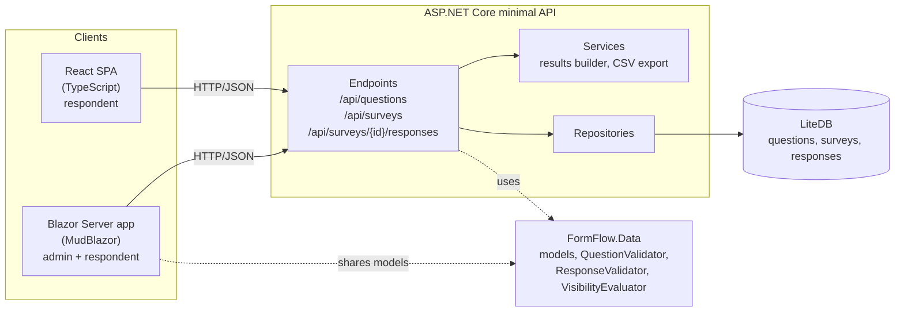

[](https://github.com/Gameyplum303/form-flow/actions/workflows/ci.yml)
[](https://github.com/Gameyplum303/form-flow/actions/workflows/lint.yml)


[](LICENSE)

# FormFlow

FormFlow is a survey builder where the questions live in a database instead of in code. Admins build a question bank, group questions into surveys, and publish them. Respondents fill them out in a Blazor or React front end, the API validates and stores every answer, and admins see live results and can export them to CSV.

It started as the capstone team project for the Software Engineering BS at East Carolina University (ECU Pirate Forge) and has since been extended into a complete, end-to-end application.


## Highlights

- **Questions are data, not code.** Seven question types (text, number, yes/no, dropdown, radio, checkbox, multiselect) with labels, help text, options, required flags and validation rules, all stored in LiteDB and editable at runtime.
- **Conditional questions.** A question can be shown only when a yes/no question has a given answer ("Preferred campus" appears only for students). The same rule runs in C# on the server and in TypeScript in the browser, and hidden answers are dropped before they are saved.
- **One validator, three clients.** Every submission goes through a single server-side `ResponseValidator` that returns RFC 7807 problem details keyed by question, so the Blazor and React apps show the same errors next to the same fields.
- **Full admin loop.** Create, edit, reorder and delete questions and surveys, preview a survey, see per-question results (option counts, number stats, recent text answers) and download responses as CSV.
- **Safe by design.** Question keys that are in use can't be renamed, questions used by a survey or a visibility rule can't be deleted, and CSV cells are escaped against spreadsheet formula injection.
- **Documented, tested, automated.** OpenAPI with Swagger UI, 200+ automated tests across four test projects, and GitHub Actions running build, tests, ESLint and `dotnet format` on every push.

## Screenshots

| Survey results (admin) | Question bank (admin) |
|---|---|
|  |  |

| React client | Swagger UI |
|---|---|
|  |  |

## Architecture



| Project | What it is |
|---|---|
| `FormFlow.Data` | Shared class library: the models, question validation, response validation and the visibility rules. Referenced by the API and the Blazor app so both speak the same types. |
| `FormFlow.Backend` | ASP.NET Core minimal API grouped by resource, with repositories over LiteDB, a results builder, a CSV exporter and a database seeder. |
| `FormFlow.Blazor` | Blazor Server app with MudBlazor. Admin pages for questions, surveys and results, plus the respondent flow. Each question type is its own component chosen at runtime. |
| `FormFlow.React` | React 19 + TypeScript client for respondents: survey list, dynamic form, conditional questions, server error display. |
| `*.Tests` | xUnit + FluentAssertions + Moq for the API and data layer, bUnit for Blazor components, Jest + React Testing Library for React. |

More detail: [docs/architecture.md](docs/architecture.md).

## Tech stack

| Area | Technology |
|---|---|
| API | .NET 10, ASP.NET Core minimal APIs, OpenAPI + Swagger UI |
| Storage | LiteDB 5 (embedded document database, no server to install) |
| Web UI | Blazor Server, MudBlazor 9 |
| SPA | React 19, TypeScript |
| Testing | xUnit, FluentAssertions, Moq, `WebApplicationFactory`, bUnit, Jest, React Testing Library |
| CI | GitHub Actions: build, test, ESLint, `dotnet format` |

## Run it locally

Prerequisites: [.NET 10 SDK](https://dotnet.microsoft.com/download) and [Node.js 20+](https://nodejs.org).

```bash
git clone https://github.com/Gameyplum303/form-flow.git
cd form-flow
dotnet dev-certs https --trust   # one time, so the Blazor app can call the API over HTTPS
```

**1. API** (http://localhost:5164, https://localhost:7209)

```bash
cd FormFlow.Backend
dotnet run
```

On first start it creates `formflow.db`, loads 10 sample questions and builds a demo "Student Experience Survey" from them. Open http://localhost:5164/swagger to try the endpoints.

**2. Blazor app** (https://localhost:7230), in a second terminal

```bash
cd FormFlow.Blazor
dotnet run
```

Go to **Take a Survey** to answer the demo survey, or **Admin Dashboard** to manage questions and surveys and see results.

**3. React app** (http://localhost:3000), in a third terminal

```bash
cd FormFlow.React
npm install
npm start
```

The React app calls the API at `http://localhost:5164`. Set `REACT_APP_API_URL` to point it somewhere else.

To start over with a clean database, stop the API and delete `FormFlow.Backend/formflow.db`.

## API

| Method | Path | Purpose |
|---|---|---|
| `GET` | `/api/questions` | List all questions |
| `GET` | `/api/questions/{id}` | Get one question |
| `POST` | `/api/questions` | Create a question |
| `PUT` | `/api/questions/{id}` | Update a question |
| `DELETE` | `/api/questions/{id}` | Delete a question that nothing depends on |
| `GET` | `/api/surveys` | List surveys |
| `GET` | `/api/surveys/{id}` | Get one survey |
| `GET` | `/api/surveys/{id}/questions` | Get a survey's questions in order, ready to render |
| `POST` | `/api/surveys` | Create a survey |
| `PUT` | `/api/surveys/{id}` | Update a survey |
| `DELETE` | `/api/surveys/{id}` | Delete a survey and its responses |
| `POST` | `/api/surveys/{id}/responses` | Submit answers (validated; returns 400 problem details per question) |
| `GET` | `/api/surveys/{id}/responses` | List stored responses |
| `GET` | `/api/surveys/{id}/results` | Aggregated results per question |
| `GET` | `/api/surveys/{id}/responses/export` | Download responses as CSV |

Request and response examples are in [docs/api.md](docs/api.md), and [FormFlow.Backend/backend.http](FormFlow.Backend/backend.http) has ready-to-send requests for VS Code or Rider.

## Testing

```bash
dotnet test FormFlow.slnx                 # Data, Backend and Blazor tests

cd FormFlow.React.Tests
npm install
npm test                                  # React tests
```

| Suite | Tests | Covers |
|---|---|---|
| `FormFlow.Data.Tests` | 39 | Question rules, response validation, visibility chains and cycles |
| `FormFlow.Backend.Tests` | 82 | Every endpoint through `WebApplicationFactory` with an in-memory LiteDB, repositories, seeding, CSV escaping |
| `FormFlow.Blazor.Tests` | 78 | Each question component, two-way binding, admin pages, taking a survey, results page |
| `FormFlow.React.Tests` | 20 | Visibility logic, the form component, and the app against a mocked API |

CI runs all of these plus ESLint and `dotnet format --verify-no-changes` on every push and pull request. See [docs/testing.md](docs/testing.md).

## Project history and my contributions

FormFlow was built by a team of students in ECU's Software Engineering program from February to April 2026: Maysun Dietrick (lead developer), Brayan Jimeno and Jared Rogers, with Brian Dietrick as project owner. The original repository is [ECU-Pirate-Forge/form-flow](https://github.com/ECU-Pirate-Forge/form-flow).

**My work during the course (Jared Rogers):**

- The `GET /api/questions/{id}` endpoint with its tests and docs ([#101](https://github.com/ECU-Pirate-Forge/form-flow/pull/101)).
- The dynamic options editor for dropdown, radio and multiselect questions in the admin create page ([#90](https://github.com/ECU-Pirate-Forge/form-flow/pull/90)).
- The Blazor `NumberQuestion` and `YesNoQuestion` components and their tests.
- Rendering many questions with one `QuestionRenderer` in both Blazor ([#47](https://github.com/ECU-Pirate-Forge/form-flow/pull/47)) and React ([#23](https://github.com/ECU-Pirate-Forge/form-flow/pull/23)).
- The LiteDB questions repository setup, an early response-submission prototype, and the project README.

**After the course, in this repository:**

At the end of the semester the app could create and list questions and surveys, but nobody could answer a survey. I finished the product loop and cleaned up the codebase:

- Answer submission with server-side validation, conditional questions, results, and CSV export in the API.
- Edit and delete for questions and surveys, with guards against breaking surveys that depend on them.
- The respondent flow and results page in Blazor, and fixed binding bugs in the radio and checkbox components.
- Connected the React app to the API with real controls for every question type.
- OpenAPI and Swagger UI, fixed CI (pull requests were never being built), added a .NET formatting check, and updated packages with known vulnerabilities.
- Removed empty placeholder projects and dead code, and rewrote the documentation.

## Documentation

- [Architecture](docs/architecture.md)
- [API reference](docs/api.md)
- [Question definitions](docs/question-definition.md) and [surveys](docs/survey-definition.md)
- [Admin pages](docs/admin.md), [Blazor components](docs/blazor-components.md), [React components](docs/react-components.md)
- [Backend](docs/backend.md) and [database](docs/database.md)
- [Testing](docs/testing.md) and [troubleshooting](docs/troubleshooting.md)

## License

MIT. See [LICENSE](LICENSE).
