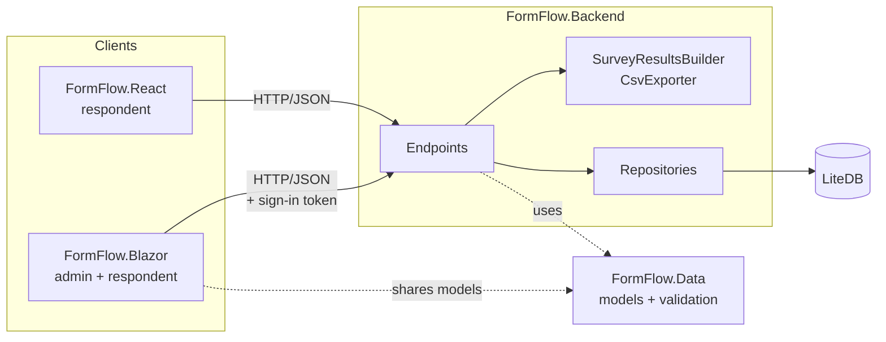

# Architecture

FormFlow is split into a shared data library, an API, and two front ends. The API is the only thing that touches the database, and every answer is validated there, so both front ends behave the same way.

## Projects

**`FormFlow.Data`** is a class library with no web dependencies.

- `Models/`: `QuestionDefinition`, `Option`, `VisibleIf`, `SurveyDefinition`, `SurveyResponse`, `SurveyResults`, the `NewQuestion` and `NewSurvey` request bodies, and `QuestionTypes` (the fourteen supported types and helpers such as `IsChoice`).
- `Services/QuestionValidator`: checks that a question definition is well formed.
- `Services/Validation/QuestionValidationEngine`: applies a question's `validationConfigs` rules (min/max length, min/max value, range) to an answer.
- `Services/ResponseValidator`: checks a full submission against a survey's questions and normalizes the answers.
- `Services/VisibilityEvaluator`: works out which questions are visible for a set of answers.

**`FormFlow.Backend`** is an ASP.NET Core minimal API.

- `Endpoints/`: one static class per resource (`QuestionEndpoints`, `SurveyEndpoints`, `ResponseEndpoints`), each mapping a `MapGroup` with OpenAPI metadata.
- `Repositories/`: interfaces and LiteDB implementations for the `questions`, `surveys`, `responses`, `users` and `account_tokens` collections.
- `Email/`: the verification and password reset emails, sent through SMTP or kept in an in-memory outbox.
- `Services/`: `SurveyResultsBuilder` aggregates responses for the results page, `CsvExporter` writes the CSV download.
- `DatabaseSeeder`: loads `SeedData/questions.json` into an empty database and creates the demo survey.
- `Program.cs`: dependency injection, CORS, problem details, OpenAPI and Swagger UI.

**`FormFlow.Blazor`** is a Blazor Server app using MudBlazor, with interactive server rendering.

- `Components/QuestionTypes/`: one component per question type, all deriving from `QuestionComponentBase`.
- `Components/QuestionRenderer.razor`: picks the component for a question's type at runtime with `DynamicComponent`.
- `Components/SurveyForm.razor`: renders a list of questions, tracks answers, hides questions whose visibility rule isn't met, and shows server errors next to each question.
- `Components/Pages/Admin/`: question and survey management, preview and results.
- `Components/Pages/Respond/`: survey list and the take-survey page.
- `Services/`: typed `HttpClient` wrappers for the API (`QuestionService`, `SurveyService`).

**`FormFlow.React`** is a React 19 + TypeScript client for respondents. See [react-components.md](react-components.md).

## Submitting a survey

1. The client opens the survey by id or by its share link (`GET /api/share/{code}`), then loads `GET /api/surveys/{id}/questions`, which returns the survey's questions in order. Drafts are only served to the people who manage them, and a closed survey or one this browser already answered shows a message instead of the form.
2. As the respondent answers, the client re-evaluates visibility after every change (`VisibilityEvaluator` in Blazor, `logic/visibility.ts` in React) so conditional questions appear and disappear immediately.
3. The client posts all answers to `POST /api/surveys/{id}/responses`, with the browser's random respondent id. The API returns `409` if the survey has closed or that id already answered.
4. The API converts the JSON answers to lists of strings, then `ResponseValidator`:
   - rejects keys that aren't in the survey,
   - drops answers to hidden questions,
   - requires answers for visible required questions,
   - checks types (numbers, yes/no, option values, single vs multiple answers),
   - runs the question's validation rules.
5. If anything fails, the API returns `400` with RFC 7807 problem details keyed by question key, and the client shows each message under its question. Otherwise the normalized answers are stored and the API returns `201`.

## Design decisions

- **Questions are referenced by key in answers and rules.** Keys are readable in CSV exports and in `visibleIf` rules. Because stored answers depend on them, the API refuses to rename a key that a survey or rule uses, and refuses to delete a question that something depends on.
- **Visibility rules depend only on yes/no questions.** `visibleIf` compares against `true` or `false`, so the API only lets it point at a `yes_no` question. The evaluator handles chains (C shows when B shows when A is yes) and treats cycles as hidden instead of looping.
- **The server is the source of truth for validation.** The clients show server errors instead of re-implementing every rule, which keeps the Blazor and React apps consistent. Visibility is evaluated on both sides because it affects what the respondent sees while typing.
- **Answers are stored as lists of strings.** Every question type fits one shape (`Dictionary<string, List<string>>`), which keeps storage, results and CSV export simple. The validator normalizes values on the way in, such as `yes` to `true`.
- **The API enforces sign-in, not the clients.** Changes require a JWT with the `admin` role and reading responses requires any signed-in role, so hiding pages and buttons in the Blazor app is only a convenience. The Blazor app keeps the token per browser tab in encrypted session storage and adds it to its API calls. Respondents never need an account.
- **LiteDB instead of a database server.** The app runs with `dotnet run` and nothing else. Repositories hide LiteDB behind interfaces, so moving to SQL would only touch the repository classes.
